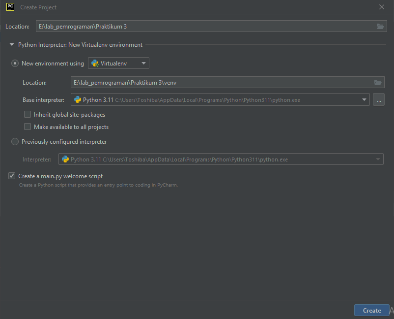
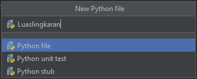
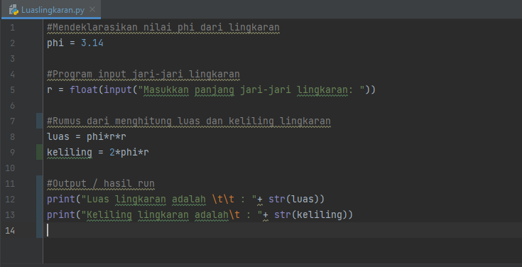
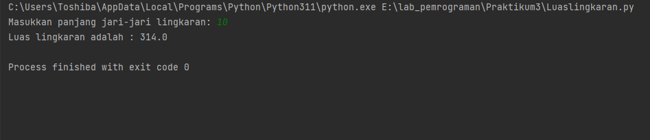
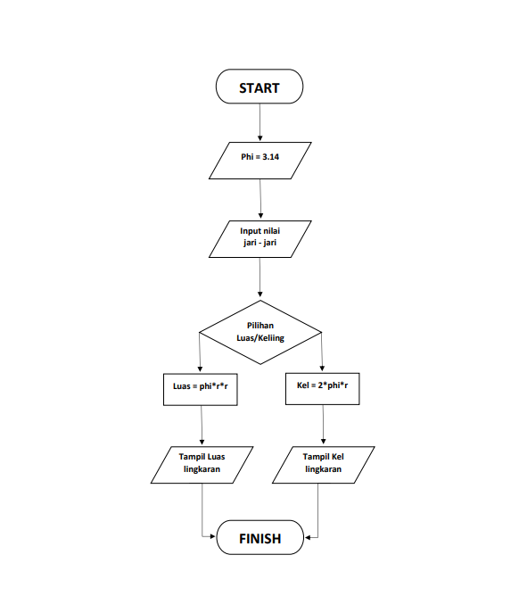

# Praktikum3
Pada tugas kali ini, Saya akan membuat program untuk mencari luas lingkaran menggunakan python beserta flowchartnya. Tidak lupa juga seperti biasanya, Saya menambahkan screenshot untuk mempermudah pembelajaran. Langsung saja masuk ke pengerjaan nya.

## Program Menghitung Luas dan Keliling Lingkaran
Pada pengerjaan kali ini, saya menggunakan sebuah software yaitu **PyCharm**. PyCharm ini sama seperti python console, namun dengan tampilan lebih menarik dan mudah digunakan. Kita bisa mendownloadnya di : ***https://www.jetbrains.com/pycharm/***. Langkahnya adalah sebagai berikut : 
• Jika sudah menginstall dan memasang PyCharmnya. Langsung saja kita membuat sebuah project baru, disini saya menamakan Praktikum3. 
 
*buat pada direktori kita masing masing*  
• Jika folder project sudah berhasil dibuat, kita tinggal membuat class / file python baru. Saya menamakannya luaslingkaran.py 
 
*file python berhasil dibuat*  
• Akhirnya file python berhasil dibuat, selanjutnya adalah memasukan program sebagai berikut : 
 
maka hasil run nya akan seperti ini :
 

## Flowchart Menghitung Luas dan Keliling Lingkaran
Jika program yang telah dibuat tersebut dibuat dalam bentuk flowchart, maka akan seperti ini : 
 
Penjelasan :  
    • Pertama yang harus dilakukan adalah mendeklarasikan nilai phi = 3.14. 
    • Lalu, masukkan nilai jari-jari yang gunanya untuk menghitung luas dan lingkaran. 
    • Setelah itu, tentukan apa yang ingin dihitung, Luas atau keliling dari lingkaran. 
    • Setelah menentukan apa yang akan kita hitung, program akan menjalankan sesuai dengan rumus yang kita masukkan. 
    • Lalu output atau hasilnya akan muncul. 

## Penutup
Sekian dari tugas yang bisa Saya kerjakan, mohon maaf jika ada kesalahan atau kekurangan dalam penulisan kata di tugas kali ini. Saya ucapkan Terimakasih...  

**Nama**    : Rhendy Diki Nugraha
**NIM**     : 312210150
**Kelas**   : TI.22.A1
**Dosen**   : Agung Nugroho, S.Kom, M.Kom
