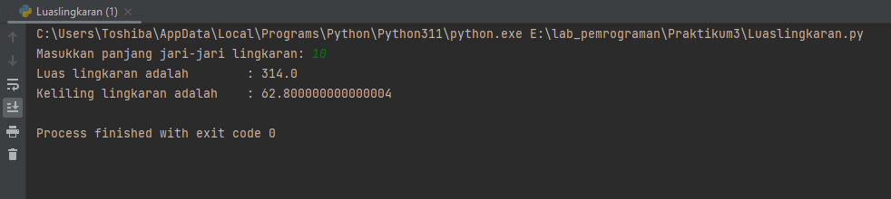

# Praktikum3
Pada tugas kali ini, Saya akan membuat program untuk mencari luas lingkaran menggunakan python beserta flowchartnya. Tidak lupa juga seperti biasanya, Saya menambahkan screenshot untuk mempermudah pembelajaran. Langsung saja masuk ke pengerjaan nya.

## Program Menghitung Luas Lingkaran
Pada pengerjaan kali ini, saya menggunakan sebuah software yaitu **PyCharm**. PyCharm ini sama seperti python console, namun dengan tampilan lebih menarik dan mudah digunakan. Kita bisa mendownloadnya di : ***https://www.jetbrains.com/pycharm/***. Langkahnya adalah sebagai berikut : 
• Jika sudah menginstall dan memasang PyCharmnya. Langsung saja kita membuat sebuah project baru, disini saya menamakan Praktikum3. 
 
*buat pada direktori kita masing masing*  
• Jika folder project sudah berhasil dibuat, kita tinggal membuat class / file python baru. Saya menamakannya luaslingkaran.py 
 
*file python berhasil dibuat*  
• Akhirnya file python berhasil dibuat, selanjutnya adalah memasukan program sebagai berikut : 
 
maka hasil run nya akan seperti ini :
 